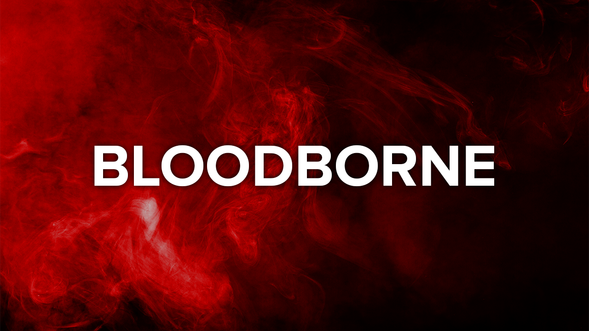

# **Bloodborne**

[GitHub]: https://github.com/AceAsin
[Discord]: https://discord.gg/U8vHS7y
[Patreon]: https://patreon.com/AceAsin
[BuyMeACoffee]: https://buymeacoffee.com/aceasin
[Ko-Fi]: https://ko-fi.com/aceasin

<div align='center'>
    <a href='https://discord.gg/U8vHS7y' title='Discord'>
        
    </a>
</div>

<div align='center'>
    <a href='https://discord.gg/U8vHS7y'>
        
    </a>
    <a href='https://patreon.com/AceAsin' title='Patreon'>
        
    </a>
    <a href='https://buymeacoffee.com/aceasin' title='BuyMeACoffee'>
        
    </a>
    <a href='https://ko-fi.com/aceasin' title='Ko-Fi'>
        
    </a>
</div>

## Download

- The download can be found on the server, [Λ C Ξ Λ S I N][Discord]. There's also more information on the server, so come stop by and say hello.
- If you want to share the package, then please redirect people to the official discord server, so that they may download the package from the respected source.

## Support

- You can support me by creating a free account, following me on [GitHub][GitHub] and starring my repositories. If you wish to donate, then please visit [Buy Me A Coffee][BuyMeACoffee] or [Ko-Fi][Ko-Fi]. If you however would like to receive early access and exclusive content, then consider becoming a patron, over at [Patreon][Patreon].

## Important

- SDK2 is now deprecated and will stop getting updates, when that happens, further support will seize to exist.

## System

### Windows

```sh
Computer\HKEY_CURRENT_USER\Software\Unity Technologies\Unity Editor 5.x
```

### macOS

```sh
~/Library/Preferences/com.unity3d.UnityEditor5.x.plist
```

### Linux

```sh
~/.local/share/unity3d/prefs
```

## Unity

- 2019.4.31f1

## Build

- Alpha
- Beta
- Public
- Private

## Version

- 2.19.0

## Date

- 2022.04.23.21.06

## Information

- Modification
  - Auto Fill Visemes
  - Auto Fix Issues
  - Auto Remove Scripts
  - Auto Remove Shaders
  - Auto Updater
  - Bug Fixes
  - Bypass Limiters
  - Performance Improvements
  - Shortcut Hotkeys

- Bypass
  - Audio Limiter
  - Height Limiter
  - Material Limiter
  - Mesh Limiter
  - Particle Limiter
  - Polygon Limiter
  - Shader Limiter
  - Station Limiter

- Custom
  - Artwork Banner
  - Asset Path
  - Avatar Thumbnail
  - Avatar Performance
  - Client Path
  - Rich Presence
  - Upload Panel
  - User Interface

- Implementation
  - Application Programming Interface
  - Content Delivery Network
  - Discord Rich Presence
  - Domain Name System
  - Internet Protocol
  - Inter Process Communication
  - Remote Configuration
  - Remote Procedure Call
  - Representational State Transfer
  - Unique Device Identification

- Generator
  - HWID
  - GUID
  - UUID

- Bundle
  - Avatar Prefab
  - World Scene

- Theme
  - Dark
  - Light

- Support
  - Android
  - Windows

- Preference
  - EditorPrefs
  - PlayerPrefs

- Library
  - Bloodborne.dll

- Plugin
  - DiscordRPC.dll
  - NativeNamedPipe.dll
  - Newtonsoft.Json.dll
  - UnityNamedPipe.dll

- Script
  - Bloodborne Asset Bundle
  - Bloodborne Background
  - Bloodborne Thumbnail

- Shader
  - Thumbnail

- Server
  - Authentication
  - Authorization

## Variable

- `{Build}` - The current build for Bloodborne SDK.
- `{Version}` - The current version for Bloodborne SDK.
- `{Date}` - The current date for Bloodborne SDK.
- `{Avatar}` - The current avatar on the pipeline manager.
- `{World}` - The current world on the pipeline manager.
- `{Project}` - The project name for Discord Rich Presence.
- `{Scene}`- The scene name for Discord Rich Presence.
- `{Play}` - The play state event for Discord Rich Presence.
  - Building
  - Compiling
  - Editing
  - Playing
  - Testing
  - Updating
- `{Pause}` - The pause state event for Discord Rich Presence. Enter in the custom text field, on the settings tab.
  - Paused
  - Unpaused

## Shortcut

- `ALT + C` - Clear Console
- `ALT + D` - Delete Cache
- `ALT + LEFT MB` - Expand/Collapse List
- `ALT + RIGHT MB` - Expand/Collapse List
- `ALT + MIDDLE MB` - Expand/Collapse List

## Markdown

- [CHANGELOG](CHANGELOG.md)
- [CONTRIBUTING](CONTRIBUTING.md)
- [LICENSE](LICENSE.md)
- [README](README.md)
